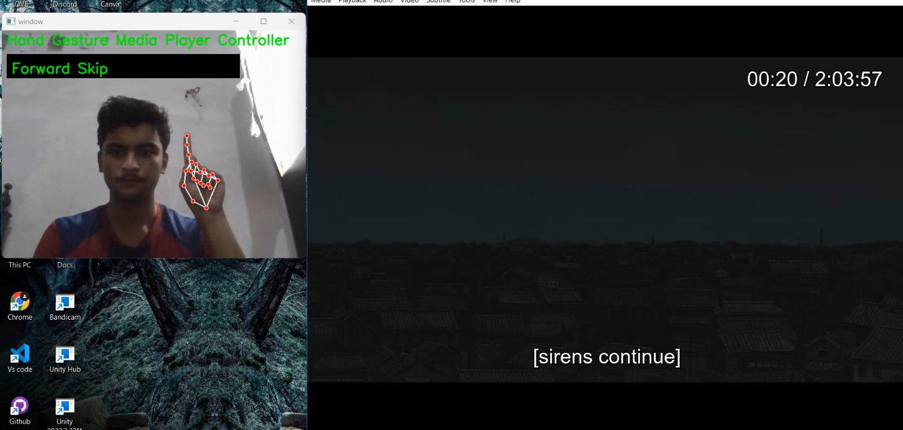
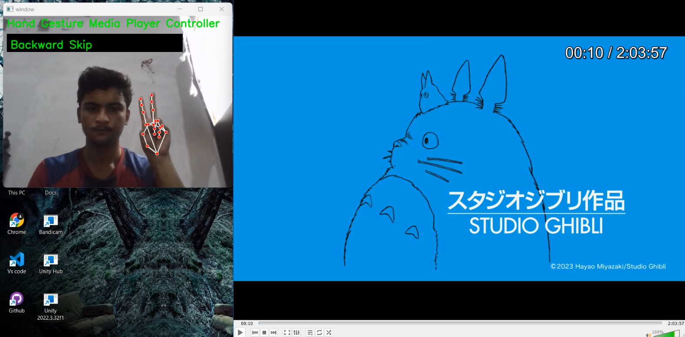
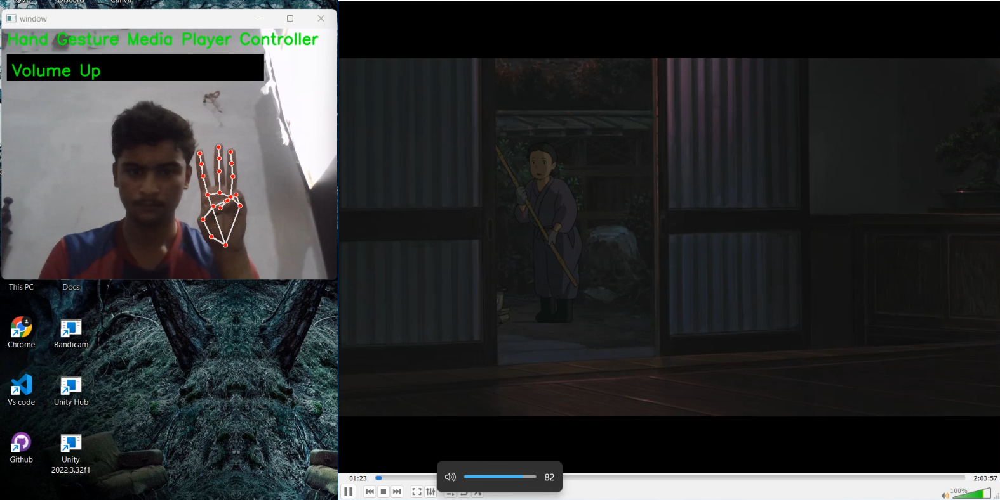
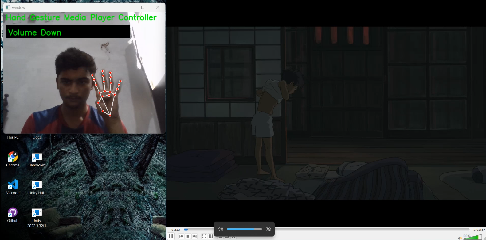
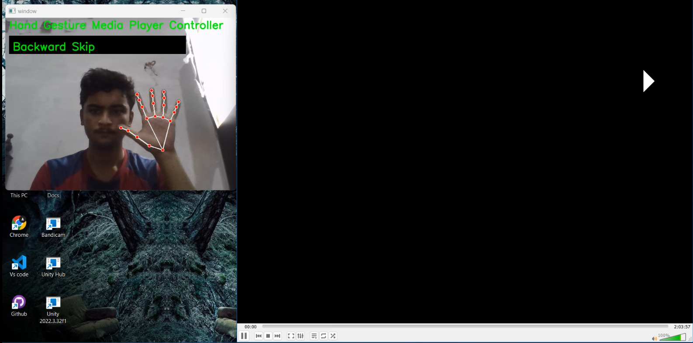
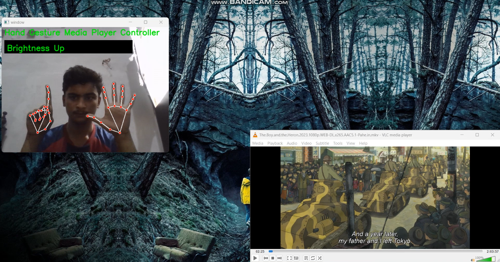

# Hand Gesture Media Player Controller

## Overview

This project is a Python-based application that uses computer vision and hand gesture recognition to control a media player. It leverages the Mediapipe library for detecting hand and facial landmarks and PyAutoGUI for automating keyboard actions. The application can recognize various hand gestures to perform actions like skipping tracks, adjusting volume, pausing/playing, and minimizing/restoring the player.

## Features

- **Forward Skip:** Show 1 finger ato skip forward.
- **Backward Skip:** Show 2 fingers to skip backward.
- **Volume Up:** Show 3 fingers to increase the volume.
- **Volume Down:** Show 4 fingers to decrease the volume.
- **Pause/Play:** Show 5 fingers to toggle pause/play.
- **Brightness Up:** Show 6 fingers to increase the brightness.
- **Brightness Down:** Show 7 fingers to decrease the brightness.
- **Minimize/Restore:** Show 10 fingers to minimize/restore the media player.
- **Automatic Minimize/Restore:** Close your eyes to minimize the player and open them to restore it.

## Examples

### Forward Skip


### Backward Skip


### Volume Up


### Volume down


### Pause/Play


### min/max


# Vid Demo      

[](https://youtu.be/MD8dZME-fBA?si=-1Zn6GeWSnknDWGM)          

Click the link above to watch the video demonstration.

## Requirements

- Python 3.6+
- OpenCV
- Mediapipe
- PyAutoGUI
- PyGetWindow

## Installation

1. **Clone the Repository:**
   ```sh
   git clone https://github.com/Raufjatoi/Hand-Gesture-Media-Player-Controller.git
   cd Hand-Gesture-Media-Player-Controller

2. **Install the Required Libraries:**
   ```sh
   pip install requirements.txt

# Usage


**Run the Application:**
    ```sh
    python project.py

## Hand Gestures:

Show specific numbers of fingers as described in the Features section to control the media player.

## Eye Gestures:

Close your eyes to minimize the player.
Open your eyes to restore the player.


# Customization

**Adjusting Sensitivity:**
You can adjust the threshold for finger counting and eye detection within the code to better suit your needs.

**Adding More Gestures:**
You can extend the code to recognize more hand gestures and map them to additional actions as needed.


# Troubleshooting

**Webcam Issues:**
Ensure your webcam is connected properly. If the application cannot open the webcam, you may need to check your system's camera settings.

**Gesture Recognition Issues:**
If the application is not recognizing your gestures correctly, try adjusting the lighting conditions and ensure your hands are within the camera frame.

# License
This project is licensed under the MIT License. See the LICENSE file for more details.

# Contributing
Contributions are welcome! Feel free to open issues or submit pull requests for improvements and new features.

# Author
[Rauf](https://personal-web-page-lemon.vercel.app/index.html)  
